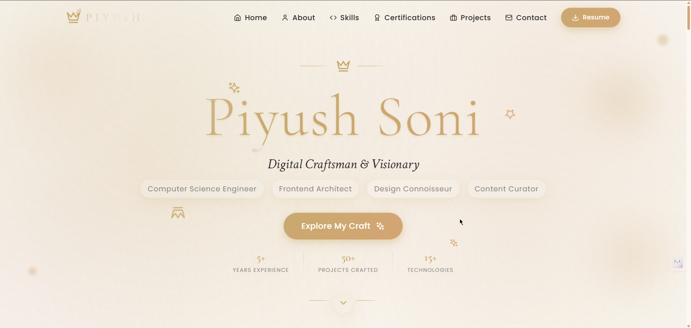
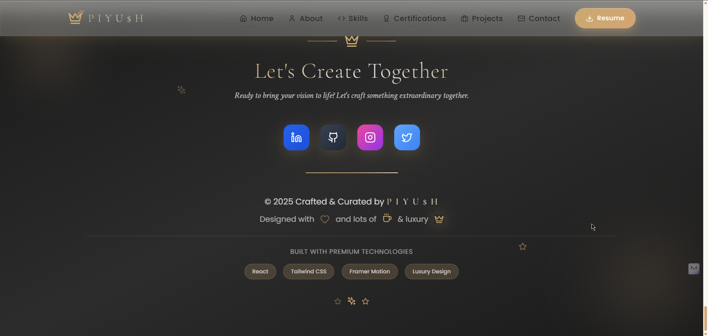

# 👑 RoyalePortfolio - The Crown Jewel of Dev Portfolios ✨

> *Where code meets creativity and pixels tell your story* 🎨💻

[](https://your-portfolio-link.vercel.app)
[](LICENSE)
[](https://reactjs.org)
[](https://www.typescriptlang.org)

---

## 🌟 What's This All About?

Meet **RoyalePortfolio** - not just another boring developer portfolio, but a stunning, interactive showcase that screams "hire me!" 🚀 

This isn't your grandpa's static HTML page. We're talking about a modern, responsive, and absolutely gorgeous portfolio website built with the latest tech stack that'll make recruiters weak in the knees and fellow developers green with envy! 💪

**Perfect for:**
- 🎯 Developers looking to stand out from the crowd
- 💼 Students wanting to showcase their projects professionally  
- 🚀 Anyone ready to level up their online presence
- 🎨 Creative minds who want beauty AND functionality

---

## ✨ Features That'll Blow Your Mind

- 🎭 **Smooth Animations** - Powered by Framer Motion for that buttery-smooth UX
- 📱 **Fully Responsive** - Looks amazing on everything from phones to ultrawide monitors
- 🌙 **Modern Design** - Clean, professional, and totally Instagram-worthy
- ⚡ **Lightning Fast** - Built with Vite for insane performance
- 🎯 **Interactive Elements** - Hover effects, smooth scrolling, and micro-interactions
- 📊 **Skills Visualization** - Beautiful progress bars and skill ratings
- 🏆 **Certifications Showcase** - Display your achievements in style
- 📞 **Contact Form** - Let potential clients reach out easily
- 🔧 **Easy Customization** - Update your info in one central data file
- 🌈 **Accessible** - Built with accessibility best practices in mind

---

## 📸 Screenshots & Preview

Get ready to feast your eyes on this beauty! 🤩


*The stunning homepage that makes a killer first impression*

  
*Clean footer with all the important links and social connections*

---

## 🛠️ Tech Stack (The Good Stuff)

This bad boy is built with some seriously impressive tech:

| Frontend | Build Tools | Styling | Developer Experience |
|----------|-------------|---------|---------------------|
| ⚛️ **React 18.3.1** | ⚡ **Vite 7.0** | 🎨 **Tailwind CSS** | 📝 **TypeScript** |
| 🎬 **Framer Motion** | 📦 **npm/yarn** | 🎯 **PostCSS** | 🔍 **ESLint** |
| 🎭 **Lucide React** | 🏗️ **Vite Build** | 📱 **Responsive Design** | 🔧 **Auto Formatting** |

**Why this stack rocks:**
- **React** - Because components are life 🧩
- **TypeScript** - Catch bugs before they catch you 🐛
- **Tailwind** - Write less CSS, create more magic ✨
- **Framer Motion** - Animations that make users go "wow!" 🤩
- **Vite** - Hot reload faster than your coffee gets cold ☕

---

## ⚙️ Installation & Setup

Ready to get this beauty running? Let's go! 🏃‍♂️

### Prerequisites
Make sure you have these installed:
- **Node.js** (v16 or higher) - [Download here](https://nodejs.org/)
- **npm** or **yarn** - (comes with Node.js)

### Quick Start
```bash
# 1. Clone this masterpiece
git clone https://github.com/piyush64-bit/RoyalePortfolio.git

# 2. Navigate to the project
cd RoyalePortfolio

# 3. Install the magic (dependencies)
npm install
# or if you're a yarn person
yarn install

# 4. Fire it up! 🚀
npm run dev
# or
yarn dev
```

Your portfolio will be live at `http://localhost:5173` 🎉

---

## 🚀 Usage Guide

### Customizing Your Portfolio

1. **Update Personal Info** 📝
   ```javascript
   // Edit src/data/portfolioData.js
   export const personalInfo = {
     name: "Your Name Here",
     title: "Your Cool Title",
     email: "your.email@domain.com",
     // ... update all fields
   };
   ```

2. **Add Your Projects** 🛠️
   ```javascript
   // In the same file, update the projects array
   export const projectsData = [
     {
       title: "Your Awesome Project",
       description: "What makes it special",
       // ... add your project details
     }
   ];
   ```

3. **Update Skills & Certifications** 🏆
   - Modify `skillsData` and `certificationsData` arrays
   - Add your own achievements and expertise levels

4. **Replace Images** 🖼️
   - Add your photo to `public/`
   - Update the image paths in the data file
   - Add project screenshots

### Building for Production
```bash
# Create optimized build
npm run build

# Preview the build locally
npm run preview
```

---

## 🛠️ Contributing

Found a bug? Have a cool feature idea? Want to make this even more awesome? 

**We'd love your help!** 🤝

1. **Fork** this repo 🍴
2. **Create** a feature branch (`git checkout -b feature/AmazingFeature`)
3. **Commit** your changes (`git commit -m 'Add some AmazingFeature'`)
4. **Push** to the branch (`git push origin feature/AmazingFeature`)
5. **Open** a Pull Request 📬

### What We're Looking For:
- 🐛 Bug fixes
- ✨ New features
- 📚 Documentation improvements
- 🎨 Design enhancements
- ♿ Accessibility improvements

---

## 🧑‍💻 About the Creator

**Piyush Soni** - The mastermind behind this beauty! 👨‍💻

A passionate Computer Science Engineering student who loves turning coffee into code and ideas into reality. When not coding, you'll find him creating content, designing graphics, or exploring the latest in tech!

### Connect with me:
- 🐙 **GitHub**: [@piyush64-bit](https://github.com/piyush64-bit)
- 💼 **LinkedIn**: [piyush64bit](https://linkedin.com/in/piyush64bit)
- ✉️ **Email**: piiyush.sonii@outlook.com
- 📷 **Instagram**: [@piyush64bit](https://instagram.com/pii.yush)

---

## 📄 License

This project is licensed under the **MIT License** - see the [LICENSE](LICENSE) file for details.

**TL;DR:** You can use this code for pretty much anything, just don't blame us if your portfolio becomes too awesome! 😄

---

## ❤️ Show Some Love

If this project helped you create an amazing portfolio, consider:

- ⭐ **Starring** this repo (it really makes our day!)
- 🐛 **Reporting** any bugs you find
- 💡 **Suggesting** new features
- 📢 **Sharing** it with fellow developers

**Made with ❤️ and lots of ☕ by [Piyush Soni](https://github.com/piyush64-bit)**

---

*Remember: Your portfolio is your digital handshake. Make it count! 🤝✨*